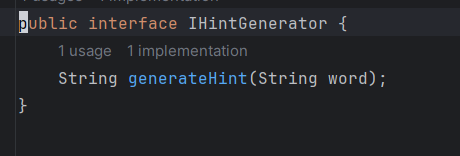

# Ejercicios:

## 1 Implementa la inyección de dependencias para las clases WordSelector y HintGenerator. (2puntos)

### Tareas:
- Crea una interfaz IWordSelector y una implementación concreta WordSelector.

    Esta interfaz proporciona un contrato que cualquier clase que implemente IWordSelector debe seguir, es decir, debe proporcionar una implementación para el método selectWord() que devuelva una cadena (String).

    La clase WordSelector es una implementación concreta de la interfaz IWordSelector. Esto significa que WordSelector proporciona una implementación específica para el método selectWord() definido en la interfaz IWordSelector.

- Crea una interfaz IHintGenerator y una implementación concreta HintGenerator.

    
    
    La interfaz IHintGenerator también define un contrato que cualquier clase que la implemente debe seguir. En este caso, la interfaz define un método abstracto llamado generateHint(String word) que toma una palabra como argumento y devuelve una pista relacionada con esa palabra.

    

    La clase HintGenerator es una implementación concreta de la interfaz IHintGenerator. Debe proporcionar una implementación específica para el método generateHint(String word) definido en la interfaz.

- Modifica la clase Game para usar estas interfaces a través de inyección de dependencias.

    

    La clase Game ahora tiene dos variables privadas: wordSelector y hintGenerator, que son instancias de las interfaces IWordSelector e IHintGenerator respectivamente. Estas variables representan las dependencias de Game.

    En el constructor de Game, se inyectan estas dependencias a través de parámetros. Esto significa que cuando creamos una instancia de Game, debemos pasar instancias de clases que implementen IWordSelector e IHintGenerator como argumentos al constructor.

    El método start() ahora utiliza estas dependencias para seleccionar una palabra y generar una pista. Primero, llama al método selectWord() del wordSelector para obtener una palabra. Luego, pasa esta palabra al método generateHint() del hintGenerator para generar una pista.

## 2. Implementa un contenedor de inyección de dependencias simple para gestionar las dependencias del juego (2 puntos)

### Tareas
#### Crea una clase DependencyInjector para gestionar las dependencias.

- DependencyInjector: Esta clase gestiona las dependencias del juego.
- wordSelector y hintGenerator: Son las dependencias necesarias para la clase Game. Se pasan a través del constructor de DependencyInjector.
- createGame(): Este método crea una instancia de Game utilizando las dependencias proporcionadas en el constructor y devuelve esta instancia.

#### Modifica la clase Game para obtener las dependencias a través del contenedor.

Ahora, en el método main(), creamos una instancia de DependencyInjector pasando instancias concretas de WordSelector e HintGenerator. Luego, llamamos al método createGame() de DependencyInjector para obtener una instancia de Game con las dependencias inyectadas, y finalmente llamamos al método start() para iniciar el juego.

## 3. Aplica principios SOLID al código del juego (3 puntos)

### Tareas
#### Refactoriza el código para cumplir con el principio de responsabilidad única (SRP) separando la lógica de selección de palabras y generación de pistas en clases separadas.

Para refactorizar el código y cumplir con el principio de responsabilidad única (SRP), vamos a separar la lógica de selección de palabras y generación de pistas en clases separadas.

Primero, crearemos dos nuevas clases: una para la selección de palabras y otra para la generación de pistas. Luego, modificaremos la clase Game para utilizar estas nuevas clases en lugar de tener toda la lógica en una sola clase.

Antes de la modificación, la lógica de selección de palabras estaba incluida dentro de la clase Game. Esto violaba el principio SRP, ya que Game estaba asumiendo dos responsabilidades: manejar la lógica del juego y seleccionar palabras.

Para cumplir con el SRP, se extrajo la lógica de selección de palabras en una nueva clase llamada WordSelector. Esta clase tiene la única responsabilidad de seleccionar una palabra aleatoria de una lista de palabras.

Esto separa claramente las responsabilidades: Game se enfoca únicamente en la lógica del juego, mientras que WordSelector se encarga exclusivamente de seleccionar palabras.

De manera similar a WordSelector, antes de la modificación, la lógica de generación de pistas también estaba incluida dentro de la clase Game. Esto también violaba el principio SRP, ya que Game estaba asumiendo múltiples responsabilidades.

Para cumplir con el SRP, se extrajo la lógica de generación de pistas en una nueva clase llamada HintGenerator. Esta clase tiene la única responsabilidad de generar una pista basada en la palabra dada.

La clase modificada Game queda asi:

Antes de la modificación, la clase Game tenía la responsabilidad de manejar toda la lógica del juego, incluyendo la selección de palabras y la generación de pistas. Esto violaba el principio SRP, ya que la clase estaba asumiendo múltiples responsabilidades.

Para cumplir con el SRP, se eliminó la lógica de selección de palabras y generación de pistas de la clase Game y se reemplazó con la inyección de dependencias de las nuevas clases WordSelector y HintGenerator. Esto significa que Game ahora depende de estas clases para obtener la palabra y la pista necesarias para iniciar el juego.

La clase Game ahora se enfoca únicamente en la lógica del juego, como iniciar el juego, manejar los turnos de los jugadores y determinar el resultado del juego (por ejemplo, si el jugador adivinó la palabra o no).

Al separar estas responsabilidades, la clase Game se vuelve más cohesiva y cumple mejor con el principio SRP. Además, ahora es más fácil de entender, mantener y probar, ya que cada clase tiene una única responsabilidad bien definida.
#### Implementa el principio de abierto/cerrado (OCP) permitiendo la extensión de la lógica de generación de pistas sin modificar las clases existentes.

Para implementar el principio de abierto/cerrado (OCP) en la lógica de generación de pistas, debemos diseñar nuestras clases de manera que puedan ser extendidas para agregar nuevas funcionalidades sin necesidad de modificar las clases existentes. Esto implica usar la herencia o composición de manera que las clases puedan ser extendidas mediante la adición de nuevas clases sin alterar las existentes.

Ahora, si necesitamos extender la funcionalidad de generación de pistas en el futuro, podemos crear nuevas clases que hereden de HintGenerator y proporcionen implementaciones adicionales según sea necesario, por ejemplo :

Con esta estructura, podemos agregar nuevas funcionalidades a la generación de pistas sin modificar las clases existentes. Esto cumple con el principio de abierto/cerrado (OCP), ya que nuestras clases están abiertas para la extensión (podemos agregar nuevas clases) pero cerradas para la modificación (no necesitamos cambiar las clases existentes).

## 4. Aplicar TDD y Jacoco para desarrollar una nueva funcionalidad y refactorizar el código existente (4puntos)

### Tareas
#### Refactoriza el código para cumplir con el principio de responsabilidad única (SRP) separando la lógica de selección de palabras y generación de pistas en clases separadas.

- Implementa pruebas unitarias para una nueva funcionalidad, como permitir al jugador
obtener una nueva pista después de un número específico de intentos fallidos.
- Refactoriza el código para implementar la nueva funcionalidad siguiendo TDD.
- Utiliza una herramienta de análisis de cobertura como JaCoCo.
- Escribe pruebas unitarias adicionales para alcanzar una mejor cobertura.
- Analice los resultados de cobertura y refactorizar el código si es necesario.

