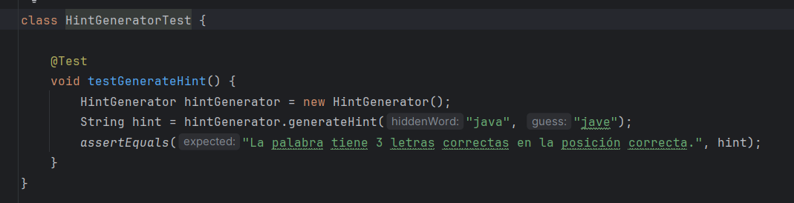

## Sprint 1: configuración básica y estructura del juego (2 puntos)
# Objetivo:
- Configurar el proyecto en Java.

Para usar Test incorporamos las dependencias necesarias: 

- Crear la estructura básica del juego.

- Implementar la lógica de selección de palabras y pistas.

# Clases:
### `Game`: Clase principal del juego.

- Propósito de la clase Game:

  La clase principal del juego, que maneja la lógica del juego en general.

  Coordina la selección de la palabra oculta, la generación de pistas y la interacción con el jugador.

- Responsabilidades de la clase Game:

  Inicializar el juego con una palabra oculta seleccionada.

  Controlar el flujo del juego, incluyendo los intentos del jugador y la retroalimentación.

  Mantener el estado del juego, como el número de intentos restantes.
### `WordSelector`: Clase responsable de seleccionar palabras.

- Propósito de la clase WordSelector:

  Seleccionar una palabra al azar de una lista de palabras disponibles.

- Responsabilidades de la clase WorldSelector:

  Mantener una lista de palabras posibles.
  Seleccionar y devolver una palabra aleatoria de la lista.
### `HintGenerator`: Clase que genera pistas.
Se inicializa un contador (correctLetters) a 0 para contar las letras correctas en la posición correcta.

Se utiliza un bucle for para iterar a través de las letras de ambas palabras, desde la primera letra (i = 0) hasta la longitud de la palabra más corta (hiddenWord.length() o guess.length(), lo que sea menor).

Dentro del bucle, se compara cada letra de hiddenWord con la letra correspondiente en guess.

Si las letras en la posición i son iguales, se incrementa el contador correctLetters.

- Propósito de la clase HintGenerator:

  Proporcionar retroalimentación al jugador sobre su adivinanza.
- Responsabilidades de la clase HintGenerato:

  Comparar la palabra oculta con la palabra adivinada por el jugador.

  Generar una pista que indique cuántas letras están en la posición correcta en la palabra adivinada.

# Pruebas unitarias iniciales:

## Clase `GameTest`

### `testHiddenWordSelection`
- **Propósito:** 
  - Verificar que el juego selecciona correctamente una palabra oculta al iniciarse.
- **Descripción del test:**
  - Este test crea una instancia de la clase `WordSelector` con una lista de palabras ("marcelo", "dearrollo", "software").
  - Se crea también una instancia de `HintGenerator`.
  - Se inicializa una instancia del juego (`Game`) utilizando el `WordSelector` y el `HintGenerator` creados, y se le asignan 5 intentos permitidos.
  - Luego, el test utiliza el método `assertNotNull` para comprobar que la palabra oculta seleccionada por el juego (`hiddenWord`) no es `null`. Esto asegura que el proceso de selección de la palabra ha ocurrido correctamente.

El test pasa correctamente

## Clase `WordSelectorTest`

### `testSelectWord`
- **Propósito:**
  - Asegurarse de que `WordSelector` selecciona una palabra de la lista proporcionada.
- **Descripción del test:**
  - Este test crea una instancia de `WordSelector` con una lista de palabras ("marcelo", "desarrollo", "software").
  - Llama al método `selectWord` del `WordSelector` para obtener una palabra seleccionada al azar.
  - Luego, utiliza el método `assertTrue` para verificar que la palabra seleccionada está dentro de la lista de palabras proporcionadas. Esto confirma que el método `selectWord` está funcionando correctamente y eligiendo una palabra válida de la lista.
  
  El test pasa correctamente

## Clase `HintGeneratorTest`

### `testGenerateHint`
- **Propósito:**
  - Verificar que `HintGenerator` genera una pista correcta basada en la comparación entre la palabra oculta y la adivinanza.
- **Descripción del test:**
  - Este test crea una instancia de `HintGenerator`.
  - Llama al método `generateHint` del `HintGenerator` con la palabra oculta "java" y la adivinanza "jave".
  - Luego, utiliza el método `assertEquals` para comparar la pista generada con la pista esperada, que es "La palabra tiene 3 letras correctas en la posición correcta.".
  - Esto asegura que el método `generateHint` está contando correctamente las letras en la adivinanza que coinciden con las letras en la misma posición en la palabra oculta.
  

Con esto, se concluye el Sprint 1. En los siguientes sprints, se  implmentara las mecánicas del juego, agregara más funcionalidades y realizara más pruebas y refactorizaciónes según sea necesario.

