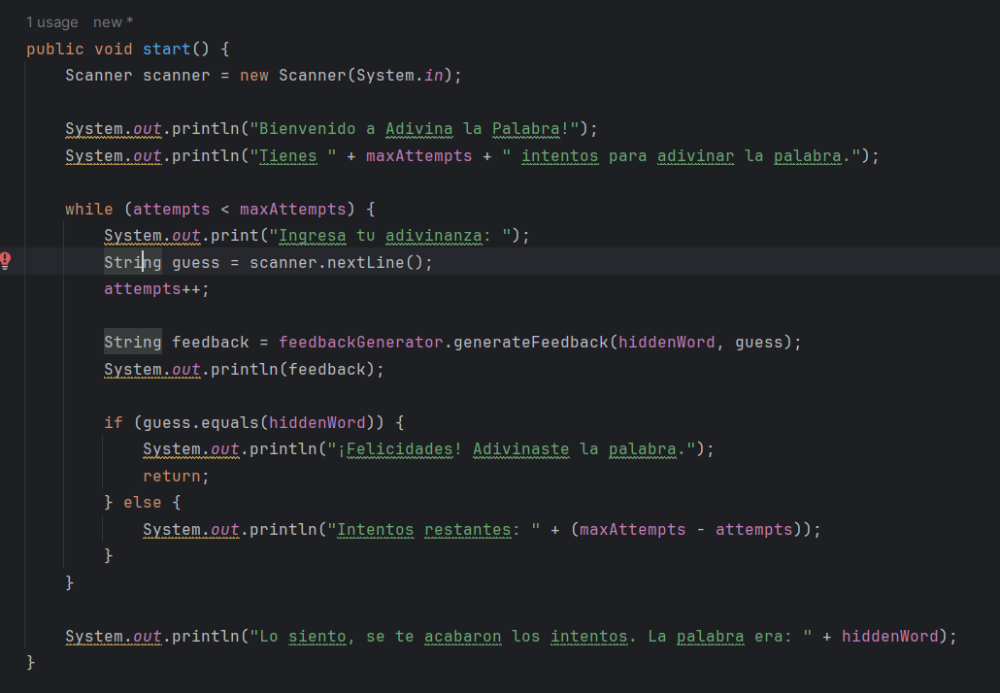
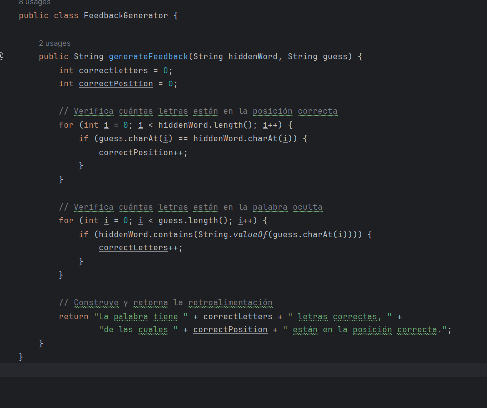
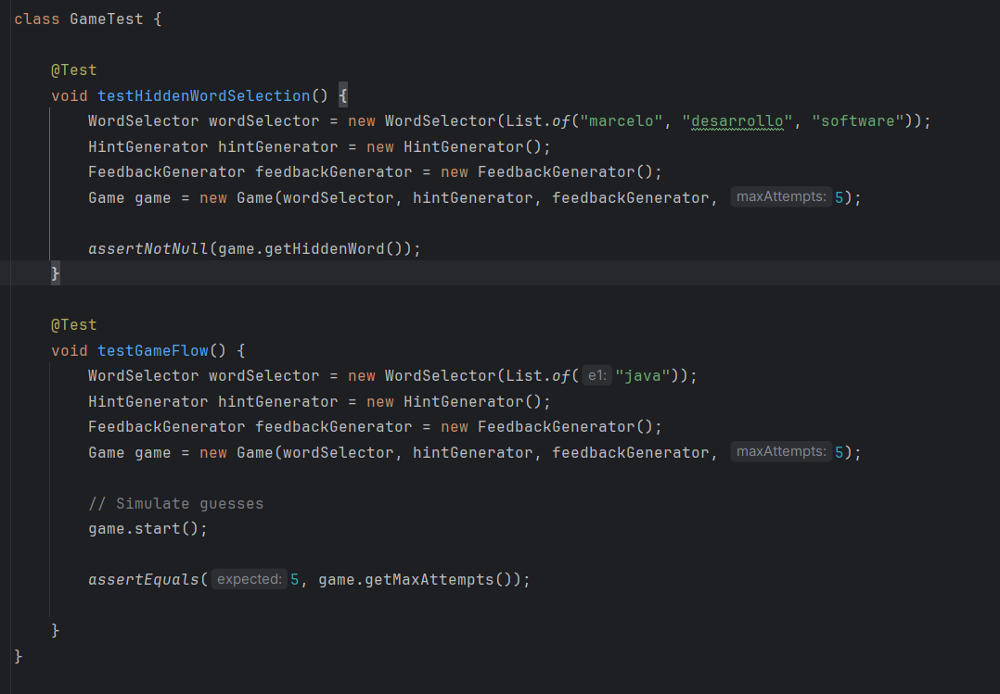
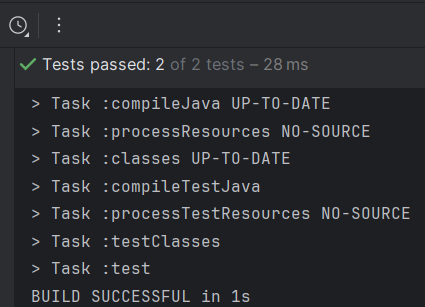
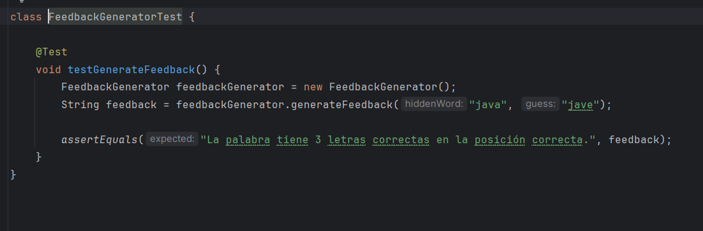
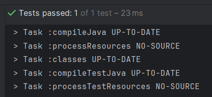
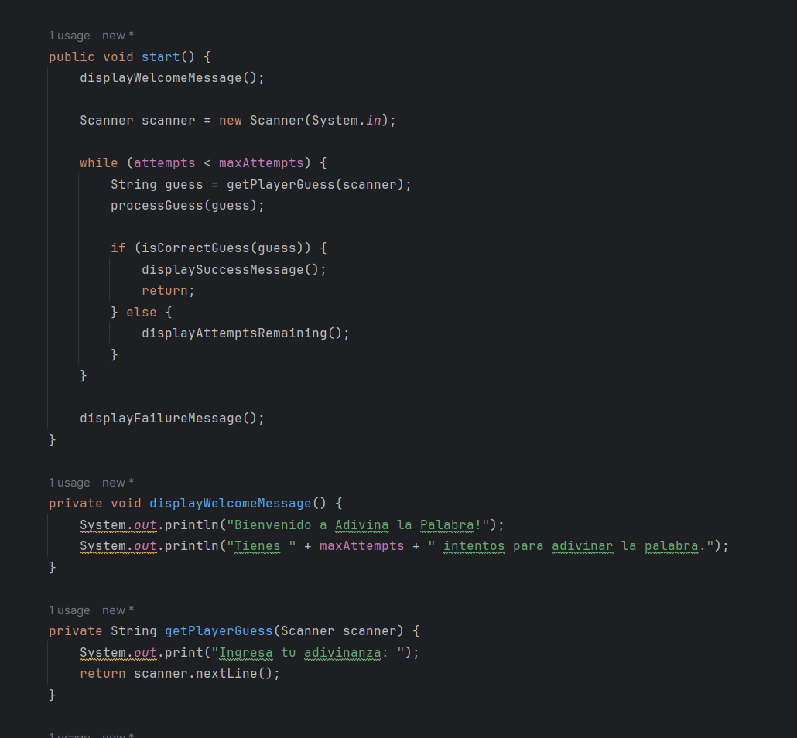
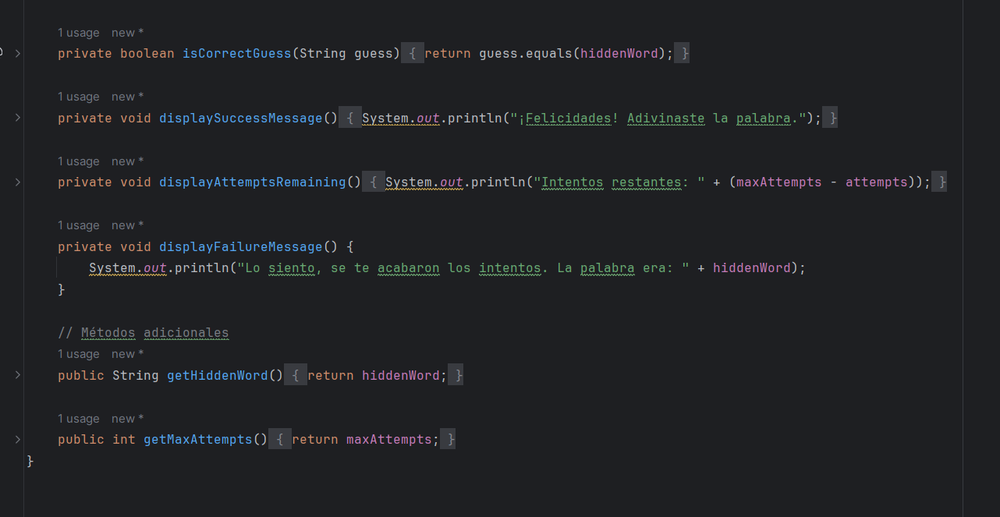

# Sprint 2: Lógica de juego y retroalimentación (3 puntos)
## Objetivo:
- Implementar la lógica de juego y retroalimentación.
- Desarrollar la interacción del jugador con el juego.

## Clases:
En este sprint se nos pide mejorar la clase Game y ademas incorporar las clase FeedbackGenerator:

• `Game`: Ampliar la funcionalidad.

- Funcionalidad Añadida:
  - Interacción con el Jugador:

    Se añadió la lógica para recibir las adivinanzas del jugador mediante el uso de Scanner para leer la entrada desde la consola.

    Se muestra un mensaje de bienvenida y se informa al jugador sobre el número de intentos disponibles.

  - Proceso de Adivinanza:

    Se implementó un bucle while que permite al jugador ingresar sus adivinanzas hasta que se agoten los intentos (attempts < maxAttempts).

    Después de cada adivinanza, se incrementa el contador de intentos (attempts++).

  - Generación de Retroalimentación:

    Utilizamos la clase FeedbackGenerator para generar retroalimentación sobre la adivinanza del jugador.

    Se muestra la retroalimentación al jugador indicando cuántas letras son correctas y están en la posición correcta.
  -  Condición de Victoria:

      Se añade una condición para verificar si la adivinanza del jugador es correcta (guess.equals(hiddenWord)).

     Si la adivinanza es correcta, se muestra un mensaje de felicitación y el juego termina (return).
    - Intentos Restantes:

      Si la adivinanza no es correcta, se muestra el número de intentos restantes al jugador (maxAttempts - attempts).
  - Condición de Derrota:

    Si se agotan los intentos sin que el jugador adivine la palabra correcta, se muestra un mensaje indicando que se han acabado los intentos y se revela la palabra oculta.

•`FeedbackGenerator`: Clase que genera la retroalimentación basada en la adivinanza del jugador.

La clase FeedbackGenerator se encarga de generar retroalimentación sobre la adivinanza del jugador comparándola con la palabra oculta. 

Descripcion:

### 1. Método generateFeedback(String hiddenWord, String guess):

- Recibe dos parámetros: `hiddenWord` que representa la palabra oculta y `guess` que es la adivinanza del jugador.
- Calcula la cantidad de letras correctas que están en la posición correcta (`correctPosition`) y la cantidad total de letras correctas (`correctLetters`).
- Utiliza dos bucles `for` para recorrer cada letra de la palabra oculta y la adivinanza del jugador, respectivamente.
- En el primer bucle, compara cada letra en la misma posición en ambas palabras. Si son iguales, incrementa el contador `correctPosition`.
- En el segundo bucle, verifica cuántas letras de la adivinanza del jugador están presentes en la palabra oculta. Cada vez que encuentra una coincidencia, incrementa el contador `correctLetters`.
- Construye un mensaje de retroalimentación que indica la cantidad total de letras correctas y cuántas de esas letras están en la posición correcta.
- Retorna la retroalimentación generada.

### 2. Uso en la Clase Game:

- La clase `Game` utiliza este generador de retroalimentación para proporcionar información detallada al jugador sobre su adivinanza.
- Después de que el jugador ingresa una adivinanza, `Game` llama al método `generateFeedback` de `FeedbackGenerator` y muestra la retroalimentación generada en la consola. 

### DETALLE:
En el diseño propuesto, la clase FeedbackGenerator realiza una función similar a la que tenía la clase HintGenerator implementada en el Sprint 1, pero con una funcionalidad más amplia. En el Sprint 1, la clase HintGenerator generaba pistas sobre la palabra oculta para ayudar al jugador a adivinarla, mientras que en el Sprint 2, la clase FeedbackGenerator proporciona retroalimentación sobre las adivinanzas del jugador, lo que incluye indicar cuántas letras son correctas y cuántas están en la posición correcta.

Por lo tanto, en el Sprint 2, la clase FeedbackGenerator asume el rol de la generación de pistas y retroalimentación, y la clase HintGenerator ya no sería necesaria.

## PRUEBAS UNITARIAS 

Dado que modificamos la clase GameTest y FeedbackGenrator, debemos implementar los test necesarios para estas clases:

#### testHiddenWordSelection():

Este test verifica que se seleccione correctamente una palabra oculta al crear una instancia de la clase Game.
Se crea un WordSelector con una lista de palabras ("marcelo", "desarrollo", "software").
Se instancia una nueva clase Game con este WordSelector, junto con instancias de HintGenerator y FeedbackGenerator, y un número máximo de intentos de 5.
Se verifica que la palabra oculta seleccionada no sea nula (assertNotNull(game.getHiddenWord())).

#### testGameFlow():

Este test verifica el flujo general del juego, incluida la interacción del jugador y el número máximo de intentos.
Se crea un WordSelector con una lista que contiene solo la palabra "java".
Se instancia una nueva clase Game con este WordSelector, junto con instancias de HintGenerator y FeedbackGenerator, y un número máximo de intentos de 5.
Se simula el flujo del juego llamando al método start() del juego.
Se verifica que el número máximo de intentos sea 5 (assertEquals(5, game.getMaxAttempts())).

### FeedbackgeneratorTest:

- testGenerateFeedback():

Este test verifica el método generateFeedback() de la clase FeedbackGenerator.
Se crea una instancia de FeedbackGenerator.

Se llama al método generateFeedback() con la palabra oculta "java" y la adivinanza "jave".

Se verifica que el resultado de la llamada sea la retroalimentación esperada, que en este caso debería ser "La palabra tiene 3 letras correctas en la posición correcta.".

## Refactorización Basada en Métricas CAMC y LCOM4

- Refactorización de la Clase Game
  - Cohesión: Agrupar métodos relacionados y asegurar que cada método tiene una única responsabilidad.
  - Complejidad: Reducir la complejidad ciclomática dividiendo métodos grandes en métodos más pequeños y más manejables.

  

  

  Con esto se concluye el Sprint 2.