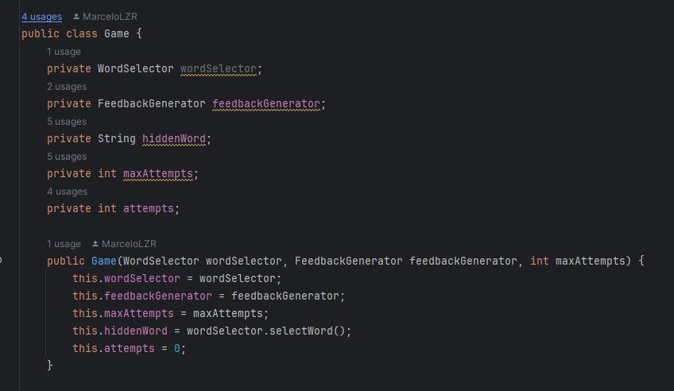
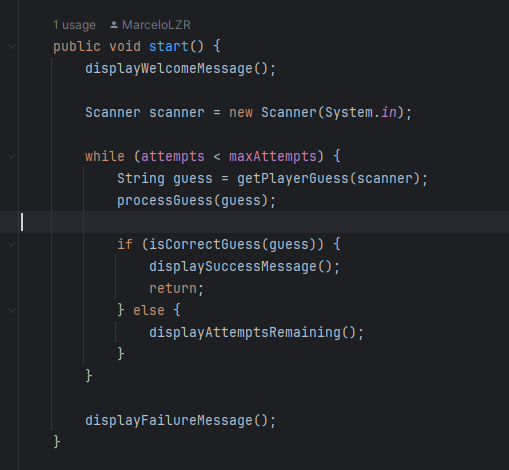
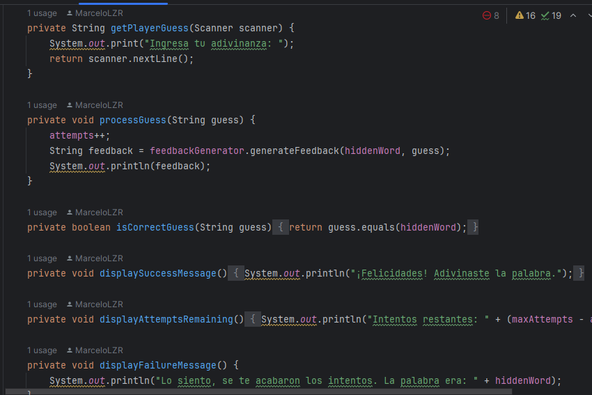
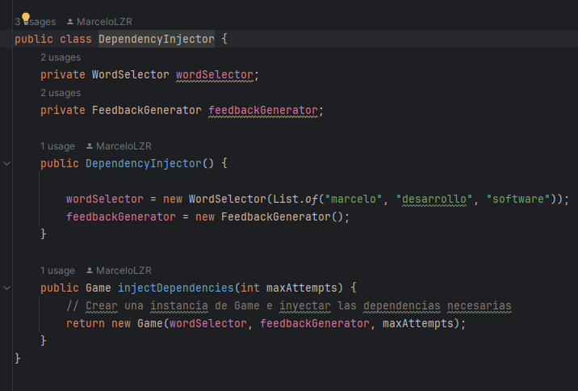
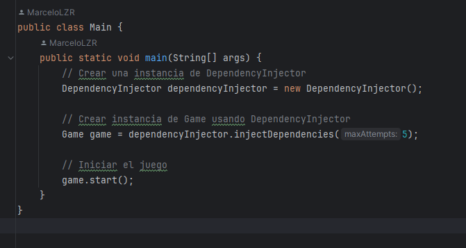
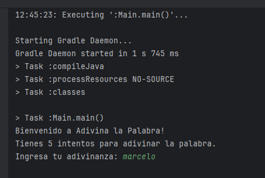

# Sprint 3: Refinamiento y finalización (4 puntos)

## Objetivo:
- Refinar el juego, optimizar el código y aplicar inyección de dependencias.
- Asegurar la alta calidad del código y la mantenibilidad.

## Clases:

• `Game`:  Integrar todas las funcionalidades y refinar la lógica.

En este código mejorado, hemos eliminado la dependencia de HintGenerator ya que no se utilizaba en la clase Game. Además, hemos refactorizado el constructor para aceptar un FeedbackGenerator en lugar de un HintGenerator. Esto asegura que Game solo dependa de lo que necesita para su funcionalidad y facilita la inyección de dependencias.

• `DependencyInjector`: Clase para manejar la inyección de dependencias

En la clase DependencyInjector, estamos creando un mecanismo para inyectar las dependencias necesarias en la clase Game. 

Explicacion:
### 1 Declaración de variables: 
Declaramos dos variables privadas, wordSelector y feedbackGenerator, que serán utilizadas para almacenar instancias de las clases WordSelector y FeedbackGenerator respectivamente.
### 2 Constructor: 
En el constructor de DependencyInjector, creamos instancias de las clases que queremos inyectar como dependencias. En este caso, inicializamos wordSelector con una nueva instancia de WordSelector que contiene una lista de palabras predefinidas, y feedbackGenerator con una nueva instancia de FeedbackGenerator.
### 3 Método injectDependencies: 
Este método toma un argumento maxAttempts, que será utilizado para inicializar una instancia de la clase Game. Dentro de este método, creamos una nueva instancia de Game utilizando las instancias de WordSelector y FeedbackGenerator que creamos en el constructor.

Finalmente creamos un main que permite al usuario poder jugar el juego:

### Uso de DependencyInjector en Main: 

En el método main de la clase Main, creamos una instancia de DependencyInjector y luego usamos su método injectDependencies para obtener una instancia de Game con todas las dependencias necesarias inyectadas.

